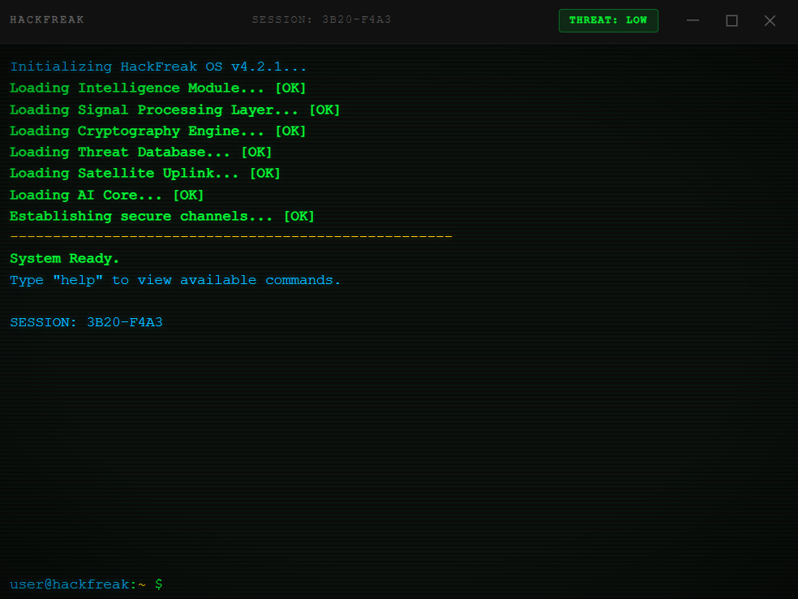
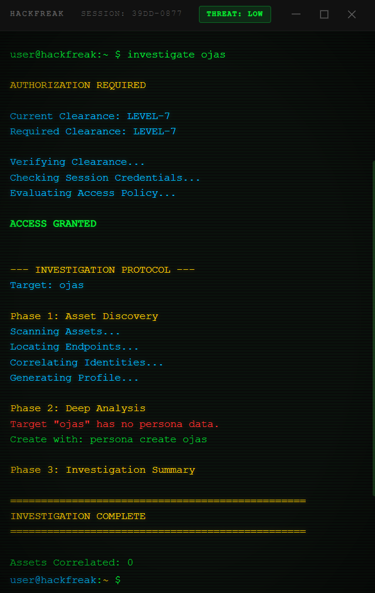
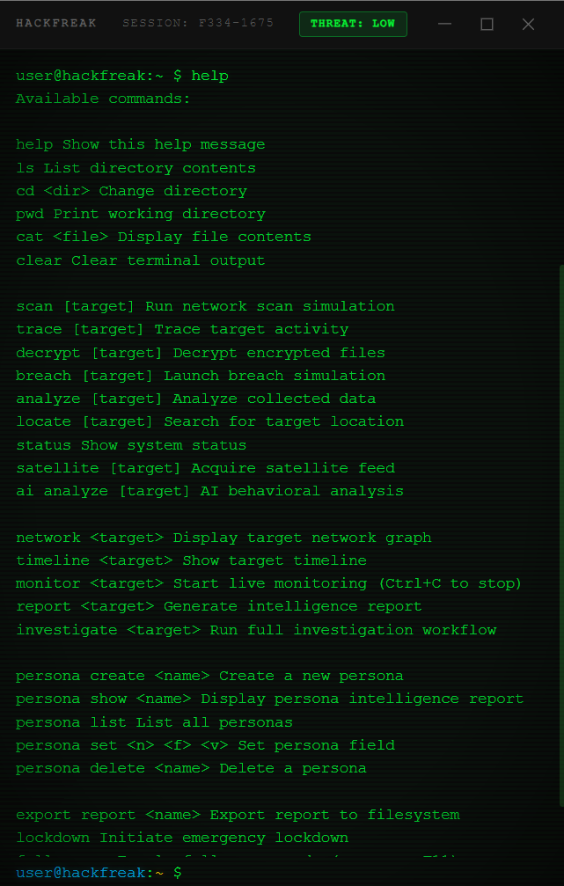

# HackFreak

A cinematic hacker terminal simulator inspired by movie hacking scenes, cyberpunk aesthetics, and intelligence workstations.

## Demo


<video controls src="Timeline 1.mov" title="Title"></video>


## What is HackFreak?

HackFreak is a cinematic intelligence terminal designed to recreate the feeling of movie-style hacker consoles.

HackFreak is not a hacking tool. It is not a penetration testing utility, exploitation framework, or cybersecurity scanner. Everything inside the application is simulated, including filesystems, intelligence workflows, threat levels, satellite sequences, reports, and target activity.

The project focuses on immersive terminal UX, atmosphere, storytelling, and cyberpunk interface experimentation.

## Features

- Cinematic boot sequence
- Dynamic personas
- Investigation workflows
- Intelligence reports
- AI analysis
- Satellite tracking
- Threat levels
- Network graphs
- Timeline reconstruction
- Live monitoring
- Terminal themes
- Fullscreen mode
- Background activity engine
- Lockdown mode

## Screenshots

Screenshot 1


Screenshot 2



Screenshot 3



## Installation

### Windows

Download the latest HackFreak installer from [GitHub Releases](https://github.com/Kodar11/hacker-terminal/releases).

### macOS

Download the latest HackFreak DMG from [GitHub Releases](https://github.com/Kodar11/hacker-terminal/releases).

### Linux

Download the latest HackFreak AppImage from [GitHub Releases](https://github.com/Kodar11/hacker-terminal/releases).

## Development

Clone the repository:

```bash
git clone https://github.com/Kodar11/hacker-terminal.git
cd hacker-terminal
```

Install dependencies:

```bash
npm install
```

Run the development app:

```bash
npm run dev
```

Build the production web bundle:

```bash
npm run build
```

Package desktop builds:

```bash
npm run dist:win
npm run dist:mac
npm run dist:linux
```

Run tests:

```bash
npm run test:unit
npm run test:e2e
```

## Example Commands

```text
persona create rahul
investigate rahul
report rahul
network rahul
timeline rahul
monitor rahul
lockdown
theme cyberpunk
```

## Themes

- matrix
- military
- cyberpunk
- amber

## Disclaimer

HackFreak is for entertainment, education, demonstrations, and UI experimentation. It contains no real hacking capabilities and does not access real systems, networks, accounts, or devices.

## Contributing

Pull requests are welcome. Good contribution areas include new cinematic scenes, new themes, improved terminal effects, new simulated workflows, bug fixes, test coverage, and documentation improvements.

## License

MIT
